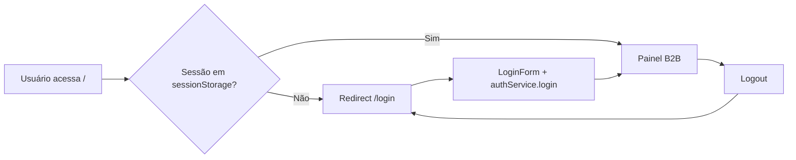

# Estapar Marcio — Portal B2B de Estacionamentos

Aplicação web para **gestão operacional de estacionamentos credenciados** da rede Estapar. O portal permite que gestores consultem garagens, configurem planos e cupons de desconto, cadastrem mensalistas e acompanhem vagas — tudo em uma interface administrativa moderna, responsiva e em português.

> Projeto desenvolvido como painel B2B (business-to-business), com dados simulados no front-end e persistência local no navegador (`localStorage` / `sessionStorage`), preparado para evoluir para uma API real.

---

## Sobre o projeto

O **Estapar Marcio** centraliza três fluxos principais:

| Área | Rota | Descrição |
|------|------|-----------|
| **Início** | `/` | Dashboard com acesso rápido a Garagens e Mensalistas |
| **Garagens** | `/garagens` | Listagem, busca, cadastro e detalhes de cada estacionamento |
| **Detalhe da garagem** | `/garagens/[codigo]` | Planos mensais, cupons de desconto e configurações |
| **Mensalistas** | `/mensalistas` | Cadastro e gestão de clientes mensalistas por garagem |
| **Login** | `/login` | Autenticação de acesso ao painel |

A arquitetura segue o padrão atual do ecossistema **React + Next.js App Router**: páginas em `src/app`, componentes reutilizáveis, **Context API** para estado global, **hooks** customizados e uma camada de **services** que simula chamadas assíncronas à API.

---

## Tecnologias utilizadas

### Stack principal (front-end moderno)

| Tecnologia | Versão | Papel no projeto |
|------------|--------|------------------|
| **[Next.js](https://nextjs.org/)** | 16.2.6 | Framework React com **App Router**, roteamento por pastas, layouts aninhados e otimização de fontes |
| **[React](https://react.dev/)** | 19.2.4 | UI declarativa, hooks (`useState`, `useEffect`, `useContext`) e Client Components |
| **[TypeScript](https://www.typescriptlang.org/)** | 5.x | Tipagem estática (`User`, `Garage`, `Mensalista`, `Plan`, etc.) |
| **[Tailwind CSS](https://tailwindcss.com/)** | 4.3 | Estilização utilitária, design system com cor de marca `#7AD33E` |
| **[react-icons](https://react-icons.github.io/react-icons/)** | 5.6 | Ícones (Lucide, Tabler, Feather, etc.) |

### Ferramentas e convenções

- **PostCSS** + `@tailwindcss/postcss` — integração do Tailwind v4 com Next.js  
- **`next/font`** — fontes **Geist** e **Geist Mono** (Google Fonts)  
- **Path alias** `@/*` → `src/*` (configurado em `tsconfig.json`)  
- **Route Groups** — pasta `(painel)` agrupa rotas autenticadas sem alterar a URL  
- **Persistência local** — `sessionStorage` (sessão do usuário) e `localStorage` (garagens e mensalistas)

---

## Como executar o projeto

### Pré-requisitos

- [Node.js](https://nodejs.org/) 18+ (recomendado 20 LTS)
- npm (ou yarn / pnpm / bun)

### Instalação e desenvolvimento

```bash
# Clone o repositório (se ainda não tiver)
git clone <url-do-repositorio>
cd estapar_marcio

# Instale as dependências
npm install

# Inicie o servidor de desenvolvimento
npm run dev
```

Abra [http://localhost:3000](http://localhost:3000) no navegador. Rotas protegidas redirecionam automaticamente para `/login` quando não há sessão ativa.

### Scripts disponíveis

```bash
npm run dev    # Servidor de desenvolvimento (hot reload)
npm run build  # Build de produção
npm run start  # Servidor após o build
```

---

## Acesso ao sistema (login)

A tela de login fica em **`/login`**. O formulário solicita **usuário** e **senha** (não e-mail).

### Credenciais (ambiente de demonstração)

A autenticação é **mockada** em `src/services/authService.ts`. Não há validação contra um banco de dados real.

| Campo | Regra |
|-------|--------|
| **Usuário** | Qualquer texto não vazio (ex.: `marcio`, `admin`, `gestor`) |
| **Senha** | Mínimo de **4 caracteres** (ex.: `1234`, `senha`) |

**Exemplo recomendado para testes:**

| Usuário | Senha | Nome exibido no painel | E-mail gerado automaticamente |
|---------|-------|-------------------------|-------------------------------|
| `marcio` | `1234` | Márcio Moraes | `marcio@estapar.com.br` |
| `admin` | `admin` | admin | `admin@estapar.com.br` |

O e-mail **não é digitado no login**; é montado no serviço como `{usuario}@estapar.com.br`.

### Cadastro de novos usuários do portal

**Não existe** tela de registro de usuários administrativos nesta versão. Qualquer usuário/senha válidos acima criam uma sessão mock. Para produção, seria necessário integrar um backend (OAuth, JWT, Active Directory, etc.).

### O que pode ser cadastrado no sistema

| Entidade | Onde cadastrar |
|----------|----------------|
| **Garagem** | `/garagens` → botão de nova garagem (modal) |
| **Mensalista** | `/mensalistas` → botão **Cadastrar Mensalista** (modal) |
| **Plano / desconto** | `/garagens/[codigo]` → abas Planos e Descontos |

---

## Estrutura do projeto

```
estapar_marcio/
├── public/                    # Assets estáticos
├── src/
│   ├── app/
│   │   ├── layout.tsx         # Layout raiz + AppProviders
│   │   ├── globals.css
│   │   ├── login/page.tsx     # Página pública de login
│   │   └── (painel)/          # Rotas autenticadas
│   │       ├── layout.tsx     # Sidebar + área principal
│   │       ├── (home)/page.tsx
│   │       ├── garagens/
│   │       └── mensalistas/
│   ├── components/            # UI (auth, layout, modais)
│   ├── context/               # Auth, Garage, Mensalista
│   ├── hooks/                 # useAuth, useGarages, useMensalistas
│   ├── services/              # Camada de dados (mock + storage)
│   ├── types/                 # Interfaces TypeScript
│   └── data.ts                # Seed inicial de garagens
├── package.json
├── next.config.ts
├── tsconfig.json
└── postcss.config.mjs
```

---

## Exemplos de código do projeto

Trechos reais que você pode replicar ou estender.

### Providers globais (React Context + Next.js)

Encadeamento de contextos no layout raiz via Client Component:

```tsx
// src/components/providers/AppProviders.tsx
"use client";

import { AuthProvider } from "@/context/AuthContext";
import { GarageProvider } from "@/context/GarageContext";
import { MensalistaProvider } from "@/context/MensalistaContext";

export const AppProviders = ({ children }: { children: React.ReactNode }) => {
  return (
    <AuthProvider>
      <GarageProvider>
        <MensalistaProvider>{children}</MensalistaProvider>
      </GarageProvider>
    </AuthProvider>
  );
};
```

### Hook customizado para autenticação

Padrão recomendado no ecossistema React: consumir contexto com validação:

```tsx
// src/hooks/useAuth.ts
import { useContext } from "react";
import { AuthContext } from "@/context/AuthContext";

export const useAuth = () => {
  const context = useContext(AuthContext);
  if (context === undefined) {
    throw new Error("useAuth deve ser usado dentro de um AuthProvider");
  }
  return context;
};
```

### Login no formulário (Client Component)

```tsx
// src/components/auth/loginForm.tsx (trecho)
const { login } = useAuth();

const handleSubmit = async (e: FormEvent) => {
  e.preventDefault();
  await login(username, password);
};
```

### Serviço de autenticação (mock + sessionStorage)

```tsx
// src/services/authService.ts (trecho)
async login(username: string, password: string): Promise<User> {
  await new Promise((resolve) => setTimeout(resolve, 800));

  if (!username || !password) {
    throw new Error("Usuário e senha são obrigatórios.");
  }
  if (password.length < 4) {
    throw new Error("A senha deve ter pelo menos 4 caracteres.");
  }

  const mockUser: User = {
    id: "u-1",
    nome: username.toLowerCase() === "marcio" ? "Márcio Moraes" : username,
    email: `${username.toLowerCase()}@estapar.com.br`,
    username,
    cargo: "Gestor Regional",
  };

  sessionStorage.setItem("estapar_user_session", JSON.stringify(mockUser));
  return mockUser;
}
```

### Tipagem de domínio (TypeScript)

```tsx
// src/types/index.ts (trecho)
export interface Garage {
  codigo: string;
  nome: string;
  endereco: string;
  cidadeUf: string;
  regional: string;
  ativo: boolean;
  vagasTotais: number;
  vagasOcupadas: number;
  vagasDisponiveis: number;
  planos: Plan[];
  descontos: Discount[];
}
```

### Uso de hook em página (Garagens)

```tsx
// src/app/(painel)/garagens/page.tsx (trecho)
"use client";

import { useGarages } from "@/hooks/useGarages";

export default function Garagens() {
  const { filteredGarages, addGarage, loading } = useGarages();
  // ...
}
```

### Layout do painel (App Router)

```tsx
// src/app/(painel)/layout.tsx
import { Sidebar } from "@/components/layout/sidebar";

export default function PanelLayout({ children }: { children: React.ReactNode }) {
  return (
    <div className="flex h-screen w-screen bg-[#F9FAFB] overflow-hidden">
      <Sidebar />
      <main className="flex-1 flex flex-col overflow-auto min-w-0">
        {children}
      </main>
    </div>
  );
}
```

---

## Fluxo de autenticação (resumo)



---

## Próximos passos de melhoria

1. **API REST ou GraphQL** — Substituir mocks e `localStorage` por backend (Node, .NET, Java, etc.) com persistência real.  
2. **Autenticação de produção** — JWT, refresh token, RBAC (perfis: gestor regional, operador, admin) e tela de cadastro/recuperação de senha.  
3. **Middleware do Next.js** — Proteger rotas `(painel)` no servidor com `middleware.ts`, reduzindo flash de conteúdo antes do redirect.  
4. **Server Components e cache** — Carregar listagens iniciais no servidor (`fetch` + `cache` / React `cache`) onde fizer sentido.  
5. **Testes** — Vitest + React Testing Library para hooks e componentes; Playwright para fluxos E2E (login, cadastro de mensalista).  
6. **Validação de formulários** — Zod + React Hook Form para CPF, e-mail e campos obrigatórios.  
7. **Acessibilidade (a11y)** — Labels, foco em modais, contraste e navegação por teclado.  
8. **Observabilidade** — Logs estruturados, Sentry e métricas de uso do painel.  
9. **Deploy** — Vercel, Docker ou pipeline CI/CD com `npm run build` e variáveis de ambiente (`NEXT_PUBLIC_API_URL`).  
10. **Internacionalização (i18n)** — Se o produto expandir além do Brasil.

---

## Licença e autor

Projeto privado (`"private": true` em `package.json`). Uso interno / portfólio conforme acordado com a Estapar.

---

**Stack em destaque:** Next.js 16 · React 19 · TypeScript · Tailwind CSS 4 · App Router · Context API · Hooks customizados
